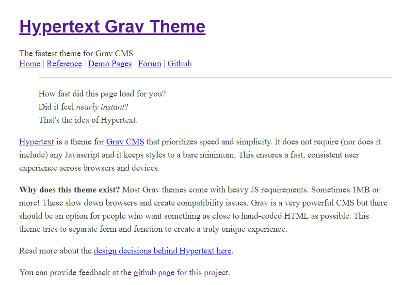

# Hypertext Theme

[Hypertext](http://hypertext.artofthesmart.com) is a theme for [Grav CMS](https://getgrav.org/) that prioritizes speed and simplicity.  It does not require (nor does it include) any Javascript and it keeps styles to a bare minimum.  This ensures a fast, consistent user experience across browsers and devices.

[You can see it live here](http://hypertext.artofthesmart.com).

**Why does this theme exist?**  Most Grav themes come with heavy JS requirements.  Sometimes 1MB or more!  These slow down browsers and create compatibility issues.  Grav is a very powerful CMS but there should be an option for people who want something as close to hand-coded HTML as possible.  This theme tries to separate form and function to create a truly unique experience.  [It even works in windows 95](assets/win95.png)!

## Features

* Virtually weightless for maximum performance
* CSS/JS squelches to completely cut out any unnecessary stuff
* Fully responsive across almost any device
* Includes `headless` parameter for serving only content
* HTML 3 & HTML 5 compliance modes
* 25 built-in, open source stylesheets

### Supported Page Templates

* Default view template `default.md`
* Error view template `error.md`
* Directory view template `collection.md`
* Blog view template `blog.md` and `blog_list.md`
* Blog item view template `item.md` and `blog_item.md`

## Getting started

Here are some links to get you started:
*  Read the installation guide below to download and install the theme.
*  [Visit the Hypertext home page](http://hypertext.artofthesmart.com) to learn more about the philosophy behind the project.
*  [Read the reference guide for caveats and gotchas](http://hypertext.artofthesmart.com/reference) to avoid common mistakes with Hypertext.
*  [Read the FAQ](http://hypertext.artofthesmart.com/FAQ) or [visit the issues page in Github](https://github.com/artofthesmart/hypertext/issues) if you run into problems.
*  [Contribute to Hypertext via Github](https://github.com/artofthesmart/hypertext) and help make the web faster!

> **Special thanks** go out to [Ricardo](https://urbansquid.london), the theme champion in the Grav Discord server, [Andy Miller](https://twitter.com/rhuk) creator of Grav CMS, and my wife who's sick of hearing about this project by now.

---

## Installation

Installing the theme can be done in one of two ways. Grav's GPM (Grav Package Manager) installation method enables you to quickly and easily install the theme with a simple terminal command, while the manual method enables you to do so via a zip file.

### GPM Installation (Preferred)

The simplest way to install this theme is via the [Grav Package Manager (GPM)](http://learn.getgrav.org/advanced/grav-gpm) through your system's Terminal (also called the command line).  From the root of your Grav install type:

    bin/gpm install hypertext

This will install the Hypertext theme into your `/user/themes` directory within Grav. Its files can be found under `/your/site/grav/user/themes/hypertext`.

### Manual Installation

To install this theme, just download the zip version of this repository and unzip it under `/your/site/grav/user/themes`. Then, rename the folder to `hypertext`. You can find these files either on [GitHub](https://github.com/artofthesmart/hypertext) or via [GetGrav.org](http://getgrav.org/downloads/themes).

You should now have all the theme files under

    /your/site/grav/user/themes/hypertext

>> NOTE: This theme is a modular component for Grav which requires the [Grav](http://github.com/getgrav/grav), [Error](https://github.com/getgrav/grav-theme-error) and [Problems](https://github.com/getgrav/grav-plugin-problems) plugins.

## Updating

As development for the Hypertext theme continues, new versions may become available that add additional features and functionality, improve compatibility with newer Grav releases, and generally provide a better user experience. Updating Hypertext is easy, and can be done through Grav's GPM system, as well as manually.

### GPM Update (Preferred)

The simplest way to update this theme is via the [Grav Package Manager (GPM)](http://learn.getgrav.org/advanced/grav-gpm). You can do this with this by navigating to the root directory of your Grav install using your system's Terminal (also called command line) and typing the following:

    bin/gpm update hypertext

This command will check your Grav install to see if your Hypertext theme is due for an update. If a newer release is found, you will be asked whether or not you wish to update. To continue, type `y` and hit enter. The theme will automatically update and clear Grav's cache.

### Manual Update

Manually updating Hypertext is pretty simple. Here is what you will need to do to get this done:

* Delete the `your/site/user/themes/hypertext` directory.
* Downalod the new version of the Hypertext theme from either [GitHub](https://github.com/getgrav/hypertext) or [GetGrav.org](http://getgrav.org/downloads/themes#extras).
* Unzip the zip file in `your/site/user/themes` and rename the resulting folder to `hypertext`.
* Clear the Grav cache. The simplest way to do this is by going to the root Grav directory in terminal and typing `bin/grav clear-cache`.

> Note: Any changes you have made to any of the files listed under this directory will also be removed and replaced by the new set. Any files located elsewhere (for example a YAML settings file placed in `user/config/themes`) will remain intact.

### Dependencies

This Hypertext theme runs on the latest version(s) of Grav CMS, namely 1.6 or higher.

## Setup

If you want to set Hypertext as the default theme, you can do so by following these steps:

* Navigate to `/your/site/grav/user/config`.
* Open the **system.yaml** file.
* Change the `theme:` setting to `theme: hypertext`.
* Save your changes.
* Clear the Grav cache. The simplest way to do this is by going to the root Grav directory in Terminal and typing `bin/grav clear-cache`.

Once this is done, you should be able to see the new theme on the frontend. Keep in mind any customizations made to the previous theme will not be reflected as all of the theme and templating information is now being pulled from the **hypertext** folder.
