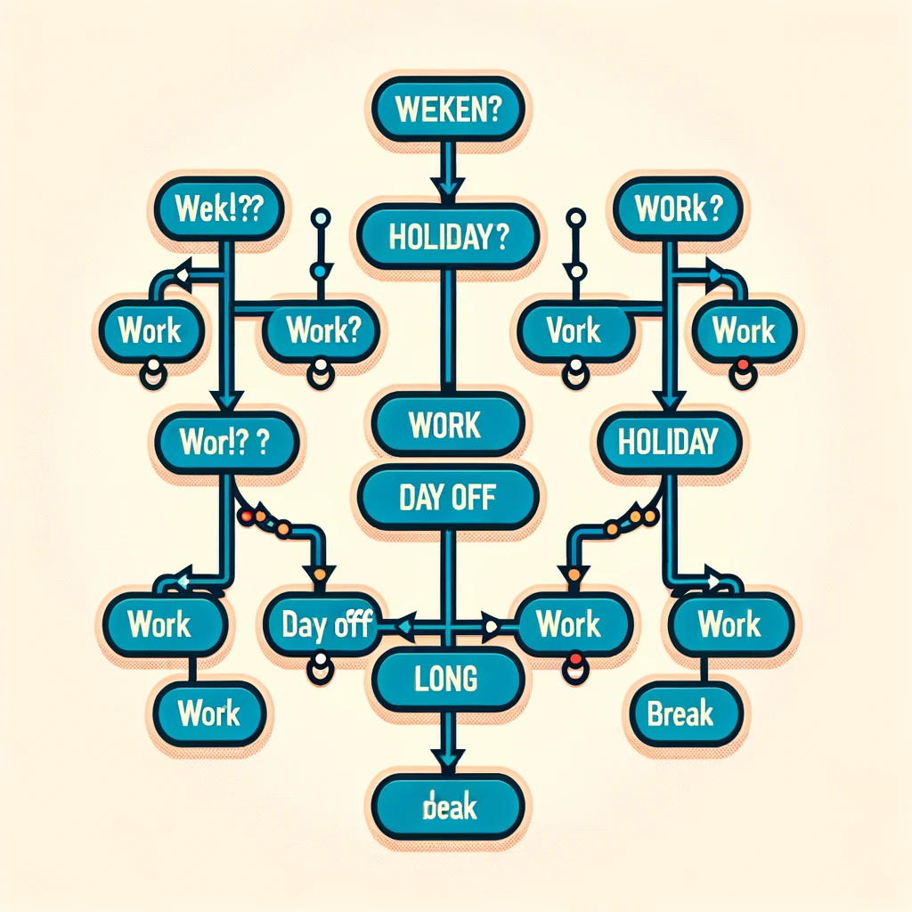

===


Hi there! It’s Michelle here again, bringing you another essential JavaScript concept right from my cozy corner in Ontario. Today, we’re diving into the world of booleans. In JavaScript, as in many other programming languages, a boolean is a primitive data type that can hold one of two values: `true` or `false`. These are incredibly useful when making decisions in your code, controlling loops, and managing conditional logic.

Booleans are often the result of comparisons or conditions. For example, when you compare two values, the result is a boolean:

```javascript
let isGreater = 10 > 9;  // true
console.log(isGreater);  // Outputs: true
```

This simple comparison checks if 10 is greater than 9, which is true, so `isGreater` holds the boolean value `true`. Booleans are straightforward but powerful. They direct the flow of execution in your programs through control structures like if-else statements and loops.

## Using Booleans with Conditional Statements

One common use of booleans is within conditional statements, where they decide which code block to execute. Here's a practical example:

```javascript
let temperature = 20; // degrees Celsius

if (temperature > 25) {
  console.log("It's a hot day!");
} else {
  console.log("It's a pleasant day!");
}
```

In this case, the `if` statement checks a condition (`temperature > 25`), which evaluates to a boolean. Depending on whether it's `true` or `false`, a different message is printed.

Booleans also come into play with logical operators, which allow you to combine multiple conditions. These operators include AND (`&&`), OR (`||`), and NOT (`!`), each manipulating boolean values to achieve complex conditions:

```javascript
let isWeekend = true;
let isHoliday = false;

if (isWeekend && isHoliday) {
  console.log("Time for a long break!");
} else if (isWeekend || isHoliday) {
  console.log("Enjoy your day off!");
} else {
  console.log("Another day at work!");
}
```

This script uses both AND and OR operators to determine what message to display based on whether it’s a weekend, a holiday, or neither.



Booleans might seem simple at a glance, but they form the backbone of decision-making in programming. Whether you’re just starting out or brushing up on your JavaScript skills, understanding how to effectively use booleans will significantly improve your ability to handle logic in your coding projects. Dive in, experiment with different conditions, and see the powerful effects of booleans in action! Happy coding!