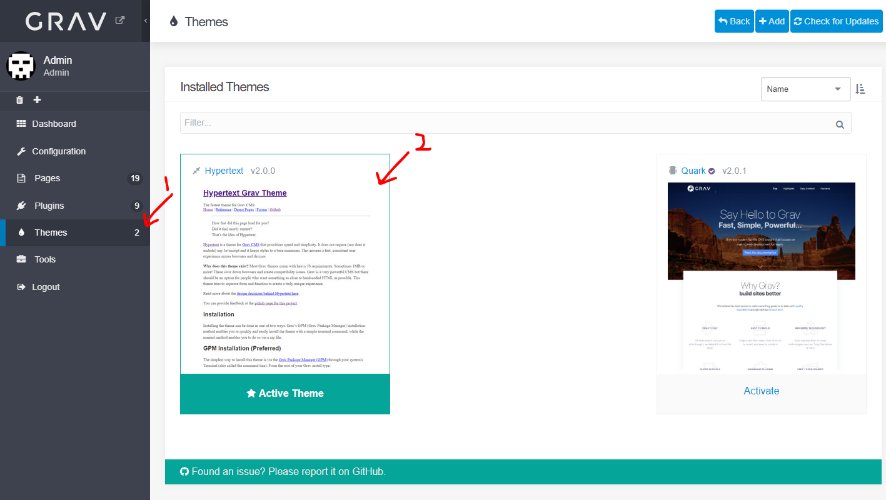
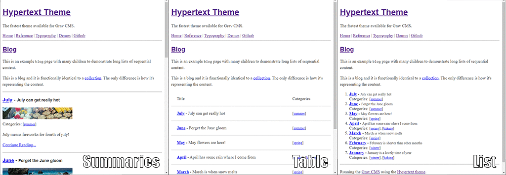

This page describes the technical details and caveats of using the Hypertext theme.

===

This is a full tour of Hypertext.

### Page Types
Grav lets you create as many page types as you want, but Hypertext only works with the 3 basic GravCMS types: pages, collections of pages, and modular pages. To match this, Hypertext offers these same 3 types as built-in page types:
- `default` - a regular page, item, blog post, image, project, or whatever.
- `collection` - a collection of `default` pages. This determines how a collection page gets rendered.
- `modular` - a modular page is a _composite_ of child pages that get rendered in a predictable way.

See the [GravCMS pages documentation](https://learn.getgrav.org/17/content/content-pages) for details on these.

### Key Features
**Enable JS/CSS** - Javascript and CSS can be suppressed across 
  - your whole site (from your theme settings at `yourdomain.com/admin/themes/hypertext`), or
  - for individual pages via the `allowCSS` and `allowJS` frontmatter options, configurable in the page editor.

!! Important: Remember that these are turned off by default, which will mess with certain plug-ins you install. [Read more about Hypertext Plug-In compatibility](Hypertext%20Plug-In%20compatibility.md).

**Headless rendering** - If you enable this site or page setting, Hypertext will only return the content of the page (including any JS/CSS you enabled/disabled as normal). This is useful for serving content for other applications like embedded browsers within a desktop application.

**Inline Resources** - You can elect to have Hypertext inline resources like CSS, Javascript, and images directly into your pages, saving network calls and speeding up rendering. While this leads to more bytes transferred overall, it can still lead to a loading speed boost for resource-light websites.  Up to you whether you want to prioritize fewer bytes transferred (inline off) or speed to render (inline on).

**Progressive Settings Overrides** - _Most_ settings are able to be overridden at the page level. This means you can set something at the theme level (e.g. "disable JS on all pages") and then override it on a page-by-page basis if needed (e.g. "enable JS for just this page, though"). Some settings can even be overridden with URL parameters like `?headless=true`. [Read more about how settings are overridden](Settings%20Overrides.md).

**Image Processing** - You can have Hypertext attempt to process images, resizing them and compressing them for serving while keeping the originals.  Good if you're coming in with an existing website, but it's always better to make your images appropriately from the beginning. Results may vary.

### Known Issues & Caveats & Notes

**Start content headers at `###` if you use styles** - The default HTML style looks fine whether you start your posts with an H1 header (`# H1 Header`) or an H3 header (`### H3 Header`).  But, if you want to use one of the many stylesheets built into Hypertext, you should probably start your pages with H3 headers or lower.  Hypertext uses H1 for the title of your website, and H2 for the title of the page currently loaded (except the home page). Any headers you use in your article, blog post, or content page should probably start from H3 to avoid style problems.

**Make your images consistently sized** - This is always true of any web work, but it's _really_ important for default-themed HTML. You can let Hypertext try to handle sizing but it's going to mean cropping and resizing which may not always be what you want. For best results, I recommend:
* Header images for pages should be your selected website width (default 768px) by about 100px high.
* Thumbnail images should be 32px by 32px.

**Missing frontmatter is bad** - If you do not specify _any_ frontmatter in a markdown file, Hypertext will work almost perfectly. However, you won't get filtering by categories. Hypertext will show you all pages within a collection without filtering them by your tag or category.

**Not all settings are elegant** - I can't test every combination of every little thing. In general, most settings look good in any combination, but there are a few that can get really ugly really fast. For example, using tabular rendering of child pages with every column turned on looks terrible on mobile devices. I trust you to pick the ones you really care about and test across devices to see what works for you.

-----------------------------------------------------------------------

### Theme Settings

The theme-level settings include options for:
* Header & Footer
* Navigation
* Plugin Support
* Structure

#### Header & Footer
These features are responsible for what renders at the top and bottom of your site.

**Sitename In Page Titles** - Boolean. Adds the sitename to the H1 of the page/item title. It is displayed as "Sitename - Item Title" (for example: "Alex's Blog - My First Post").

**Header Style** - Dropdown. Changes how the header/sitename is displayed. There are five options:
- `Text` - Default. The text name of the site.
- `Image` - A banner image to render where the site name would normally be. It's linked to your home page.
- `Both` - The site name followed by rendering the image below it. Useful when you want a little branding but also want the name of the site visible.
- `Modular` - Searches for a page named `_header.md` and renders that. See details below about Modular Content.
- `None` - Renders nothing above the navigation bar.

Note: When `image` or `both` is selected, you'll have an option to upload an image.

**Subheader** - Boolean. Selects whether or not to show the site's subheader at the top of the page. If true, the user will be presented with the option to enter a subheader. 

Note: This is different from GravCMS's standard site description which is useful for SEO.

**Footer** - Dropdown. Determines what/how to render a footer for the site.
- `Content` - Default. The user is presented with a text box where they can add markdown footer content.
- `Modular` - Searches for a page named `_footer.md` and renders that. See details below about Modular Content.
- `None` - Renders no footer after the content of the site.

#### Navigation
These features define how navigation gets rendered on the screen. Relevant classes and IDs are assigned to each link in the HTML output to allow for easy styling downstream.

**Menu Bar Format** - Dropdown. Determines how the menu bar is displayed.
- `Inline` - Default. The menu bar is displayed in a single line.
- `Stacked` - The menu bar is displayed in multiple lines as a bulleted list.
- `None` - Renders no menu bar.

**Nav Text Style** - Dropdown. Determines how the menu bar text is displayed.
- `Brace Decorated` - Default. The menu bar text is rendered with braces, e.g. `[ Home ] [ About ] [ Contact ]`.
- `Angle Decorated` - The menu bar text is rendered with angle brackets, e.g. `< Home > < About > < Contact >`.
- `Plain` - The menu bar text is displayed without decoration, e.g. `Home About Contact`.

**Pagination Structure** - Dropdown. Determines how pagination is displayed site-wide (i.e. on collection pages).
- `Inline` - Default. Pagination is displayed in a single line.
- `Stacked` - Pagination is displayed in multiple lines.

**Pagination Text Style** - Dropdown. Determines how pagination text is displayed.
- `Brace Decorated` - Default. The pagination text is rendered with braces, e.g. `[ 1 ] [ 2 ] [ 3 ]`.
- `Angle Decorated` - The pagination text is rendered with angle brackets, e.g. `< 1 > < 2 > < 3 >`.
- `Plain` - The pagination text is displayed without decoration, e.g. `1 2 3`.

**Show Social Buttons** - Dropdown. Selects whether or not to show social buttons. If true, the user will be presented with the option to add social buttons.
- `None` - Default. Renders no social buttons.
- `With Navigation` - The social buttons are displayed after the navigation bar.
- `Top Right` - The social buttons are displayed at the top right corner of the page with the Header.

**Custom Menu Items** - Array Field. Allows the user to add custom menu items as `Title` and `URL` pairs. These items will be displayed in the menu bar after any automatically generated menu items like pages. This is useful for linking to pages that are not in the navigation menu, or for adding custom links to the navigation menu.

#### Plugin Support
In a perfect world we would support all of the GravCMS default plugins offered by the company. Below are a few examples:
- Shortcodes
- TOC
- Breadcrumbs
- Simple search

#### Structure
**Favicons** - Dropdown. Determines how to handle favicons for the site.
- `Default` - Default. Uses the default GravCMS favicon.
- `Upload` - The user can upload a favicon.
- `Select From GravCMS List` - The user can select a favicon from the GravCMS list.

**Accessible Typeface** - Boolean. Uses the [Atkinson Hyperlegible typeface](https://brailleinstitute.org/freefont) from the Braille Institute for all text, instead of any theme's default typeface. Turn it on if you can afford the page weight. *Watch Out:* this adds over 100kb to the page load!
- `FALSE` - Default. The site will use the theme's default typeface.
- `TRUE` - Applies the typeface to text.

**ARIA Landmark Roles** - Boolean. Determines whether or not to add ARIA landmark roles to the site. Not strictly necessary but improves support for screen readers and older browsers at minimal page weight cost.
- `TRUE` - Default. Adds ARIA landmark roles to the site.
- `FALSE` - The site will not use ARIA landmark roles.

**Image Include** - Dropdown. Determines how images are included in the site.
- `Linked` - Default. Images are linked in the site as normal. Results in smaller page sizes but slower overall load times with more network requests. Use for sites that have lots of images or heavy image reuse.
- `Embedded` - Images are Base64 encoded and embedded into HTML responses. This reduces network requests at the expense of sending a single, larger file at once. Use for sites with few images.

**Resize Images To Fit** - Boolean. Determines whether or not to resize images to fit the site.
- `TRUE` - Default. Images are resized to Hypertext optimal sizes. For example, a Header image would be crop-resized to 768px wide and 128px high, while a page thumbnail image would be resized to 128px wide and 128px high to fit cards.
- `FALSE` - Images are rendered at the size you uploaded.

**Image Compression** - Dropdown. Determines whether or not to compress and re-encode images. This reduces image filesize to speed up delivery.
- `None` - Default. Images are not changed when uploaded.
- `Medium` - Images are compressed at 80% quality and converted to WebP.
- `High` - Images are compressed at 60% quality and converted to WebP.
- `Extreme` - Images are aggressively compressed at 50% quality and converted to WebP, sized smaller than they'll appear on most screens.

**Allow URL Params** - Dropdown. Determines whether or not to allow URL parameters to override theme and page settings.
- `Admin Only` - Default. URL parameters are only allowed for a signed-in user.
- `Never` - URL parameters are never allowed.
- `Always` - URL parameters are always allowed.

**Nav Alignment** - Dropdown. Determines the alignment of the navigation bar.
- `Left` - Default. The navigation bar is aligned on the left.
- `Center` - The navigation bar is aligned to the center.
- `Right` - The navigation bar is aligned on the right.

**Site Layout** - Dropdown. Determines the layout of the site. See details below about Modular Content. There's a section in Style that lets you decide column widths.
- `1 Column` - Default. The site is displayed in one column.
- `2 Column (left)` - The site is displayed in two columns. The primary content is in the right column and the secondary content is in the left column. This mode searches for a page in the `user/pages` directory named `_column_left.md` and renders that.
- `2 Column (right)` - The site is displayed in two columns. The primary content is in the left column and the secondary content is in the right column. This mode searches for a page in the `user/pages` directory named `_column_right.md` and renders that.
- `3 Column` - The site is displayed in three columns. This mode searches for pages in the `user/pages` directory named `_column_left.md` and `_column_right.md` and renders them in the left and right columns respectively.

##### About Modular Content
Modular content is a feature that allows the user to create custom page layouts. It is a way to organize content in a way that is not possible with the standard page layout. Modular content is made up of a series of "modules" that are arranged in a specific order. Each module has a specific purpose and can be used to display different types of content. Hypertext will look for theme-specific modular content in the root pages directory first, followed by each lower directory until it reaches the current page. For example, you might define `_footer.md` in `user/pages` and again in `user/pages/03.blog/`. That means the footer in `user/pages` will be used everywhere on the site _except_ any pages in the `03.blog` directory and below.

#### Style & JS
**Alignment** - Dropdown. Determines the alignment of the content. This doesn't affect left-to-right reading or paragraph alignment, just where the wrapper of the page resides.
- `Left` - Default. The content is aligned to the left of the screen.
- `Center` - The content is aligned to the center.
- `Right` - The content is aligned to the right of the screen.

**Column Widths** - Array Field. Allows the user to define the width of each column in the site layout. For a 1-column layout, this field is hidden. For a 2-column layout, this field shows two inputs for the width of the left and right columns respectively. For a 3-column layout, it shows three inputs. The nominal values aren't important: the proportions between them are used to determine the width of each column. For example, writing `50` and `25` for a two column layout will produce a two column site where the left column is twice as wide as the right column.

**Total Width** - Dropdown. Determines the overall maximum width of the content for large screens.
- `None` - No style (full width)
- `640px` - 640px (very small)
- `768px` - 768px (small)
- `960px` - 960px (medium) - Default
- `1024px` - 1024px (large)
- `1280px` - 1280px (very large)

**Allow CSS** - Boolean. When set to `false` this will actively block CSS from being output to the page from any source, including your own CSS, selected styles, or even plug-ins. Allowing CSS here will display other options. Remember that this can be overridden on the collection or page level.
- `false` - Default. Prevents the use of CSS.
- `true` - Allows CSS to be used.
**Custom CSS** - Textarea. Allows you to add custom CSS to include site-wide after all other style sources. This should be used for simple tweaks and overrides. For larger projects, use a CSS file instead.
**CSS Include Mode** - Dropdown. Determines how the CSS is included in the site.
- `Inline` - Default. All CSS is inlined into the site and delivered on each page load. Prioritizes speed for sites with little CSS.
- `File` - Hypertext attempts to send CSS as separate files fetched with separate network requests. This means more network requests per page load up-front, but fewer overall as the browser will cache the individual files.
- `Consolidated` - Hypertext consolidates and minifies CSS files into a single CSS file, sent as a single network request. This mode means fewer network requests per page load, but it's more likely to require network requests for every page load.

**Allow JavaScript** - Boolean. When set to `false` this will actively block JavaScript from being output to the page from any source, including your own JavaScript, selected styles, or even plug-ins. Allowing JavaScript here will display other options. Remember that this can be overridden on the collection or page level.
- `false` - Default. Prevents the use of JavaScript.
- `true` - Allows JavaScript to be used.
**Custom JavaScript** - Textarea. Allows you to add custom JavaScript to include site-wide after all other style sources. This should be used for simple tweaks and overrides. For larger projects, use a JS file instead.
**JavaScript Include Mode** - Dropdown. Determines how the JavaScript is included in the site.
- `Inline` - Default. All JavaScript is inlined into the site and delivered on each page load. Prioritizes speed for sites with little JavaScript.
- `File` - Hypertext attempts to send JavaScript as separate files fetched with separate network requests. This means more network requests per page load up-front, but fewer overall as the browser will cache the individual files.
- `Consolidated` - Hypertext consolidates and minifies JavaScript files into a single JavaScript file, sent as a single network request. This mode means fewer network requests per page load, but it's more likely to require network requests for every page load.

!!! [See the home page for a speed analysis](/) between inline, file, and consolidated include modes.

##### Themes & Styles
Themes in Hypertext are open-source CSS files available on GitHub and are not my own work. Consider visiting their homepages, contributing, and supporting the authors. Remember that you can test these styles quickly by enabling URL Parameters above and then applying the short-name or number to a style URL parameter, e.g. `YourSite.com/?style=water` or `YourSite.com/?style=4`.

!!! This is a great way to quickly thumb through styles for your website. Use the numbers to find what looks good, then match it to the style in the Theme settings. Try it here on the microsite! [Theme 3](/reference?theme=3), [Theme 6](/reference?theme=6), [Theme 9](/reference?theme=9), [Theme 12](/reference?theme=12).

You can check the [style examples table](#style_table) in the Appendix to see what each style looks like.

!!! Remember that many of these themes offer customization. Search for them on Github and read their documentation about how to customize things like colors.

-----------------------------------------------------------------------

### Page Settings
The page-level settings include overrides to the global settings as well as controls for how to render your content. Remember that these values can be set at the Theme level, at the Collection level, or the page level at the lowest. The lowest level wins.

Below are settings for individual pages, items, blog posts, and other "single pages". These also appear in `Collection` pages because they control how child pages get rendered, too.

#### Page Content
These values let you decide what frontmatter and metadata get rendered on the page to the end user.

**Show Title** - Boolean. Determines whether or not to show the title of the page.
**Show Subtitle** - Boolean. Determines whether or not to show the subtitle of the page.
**Show Header Image** - Boolean. Determines whether or not to show the header image of the page.
**Show Author** - Boolean. Determines whether or not to show the author of the page.
**Show Last Updated** - Boolean. Determines whether or not to show the last updated date of the page.
**Show Publish Date** - Boolean. Determines whether or not to show the publish date of the page.
**Show Tags** - Boolean. Determines whether or not to show the tags of the page.
**Show Categories** - Boolean. Determines whether or not to show the categories of the page.
**Use Headless Mode** - Boolean. Determines whether or not this page is rendered in headless mode. If true, the theme will not render anything except the page's content. No header, no metadata, no titles, no footer, nothing. Just the body content of parsed markdown into HTML. The content will get a `<body>` tag and the proper DOCTYPE.

##### Collection Page Content
These content settings only appear for collection pages to help define how their children get rendered.
**Show Summary** - Boolean. Determines whether or not to show the summary of the page.
**Show Clickthru** - Boolean. Determines whether or not to show the "Read More" click-through text on page summaries. These words are defined in `languages.yaml` and can be changed.

#### Additional Content
Here you can define additional content and metadata for your page, similar to other themes.

**Subtitle** - The subtitle is a longer title addition or explanation of the content that will sometimes appear in Hypertext. For example, a title could be "CSS 101" and the subtitle could be "Learning how to make your website more beautiful".

**Header Image File** - The header image appears at the top of the page under the page title. You can specify which image to use for the page header here.  It's an image that appears at the top of the page.  If you don't name an image specifically, Hypertext will try to find one automatically, e.g. using the file name pattern `header.*` within the page directory and `<page_slug>_header.*` in other locations. When you enable header images, Hypertext will look for a header image with the following rules:

    0.  For any of the following, look for `png`, then `gif`, then `jpg`, then `webp` file types.
    1.  Try to use the specified filename in the page directory.
    2.  Try to use the specified filename in the `user/images` directory.
    3.  Try to find an image named `header.*` in the page directory.
    4.  Try to find an image named `<page slug>.*` in the `user/images` directory.
    5.  Try to find an image named `<page slug>_header.*` in the `user/images` directory.
    6.  Try to use the first image in this page's directory.

**Thumbnail image file** -  You can specify which image to use for the page thumbnail here.  It's an image used by a parent page trying to draw child pages.  If you don't name an image specifically, Hypertext will try to find one automatically, for example using the file name pattern `thumbnail.*` within the page directory and `<page_slug>_thumbnail.*` in other locations. When you enable header images, Hypertext will look for a thumbnail image with the following rules:
    0.  For any of the following, look for `png`, then `gif`, then `jpg`, then `webp` file types.
    1.  Try to use the specified filename in the page directory.
    2.  Try to use the specified filename in the `user/images` directory.
    3.  Try to find an image named `thumbnail.*` in the page directory.
    4.  Try to find an image named `<page slug>_thumbnail.*` in the `user/images` directory.
    5.  Try to find an image named `<header image filename>_thumbnail.*` in the page directory, if a header image was specified.
    6.  Try to find an image named `<header image filename>_thumbnail.*` in the `user/images` directory, , if a header image was specified.
    7.  Try to use the header image search method described above and use the header image.
    8.  Try to use the first image in this page's directory.

* **Summary length** - If you don't specify a summary for this page, this value determines how long the automatically generated summary should be.  By default, it's 300 characters.

* **Add Dates** - Overrides the theme's global dates setting and lets you choose whether to show the publication date on this page or not.

!!! **What's the difference between a Summary and a Subtitle?**  A subtitle is usally an extension to the original title.  For example, "Raising a puppy" might be the title of my page, and the subtitle might be "How I learned to raise a dog in 2018".  On the other hand, a summary is a short introduction or paragraph for the content the user is about to read or click through to.  In this same example, the summary would be a 300 character teaser about how cute the puppy was, how excited I was, and how I would learn a lot while training the puppy to be a good boy.

#### Page Content Settings
When rendering a page, these settings can be used to override the theme and collection settings for that specific page. If a setting is not set, it will use the theme's default setting. Some settings are specific to how pages and collections function and cannot be set at a site-wide level effectively.

These determine what metadata from the frontmatter should be shown when rendering a page.

**Show Title** - Boolean. Determines whether or not to show the title of the page.
**Show Subtitle** - Boolean. Determines whether or not to show the subtitle of the page.
**Show Header Image** - Boolean. Determines whether or not to show the header image of the page.
**Show Author** - Boolean. Determines whether or not to show the author of the page.
**Show Last Updated** - Boolean. Determines whether or not to show the last updated date of the page.
**Show Publish Date** - Boolean. Determines whether or not to show the publish date of the page.
**Show Tags** - Boolean. Determines whether or not to show the tags of the page.
**Show Categories** - Boolean. Determines whether or not to show the categories of the page.
**Show Summary** - Boolean. Determines whether or not to show the summary of the page.
**Show Clickthru** - Boolean. Determines whether or not to show the "Read More" click-through text on page summaries. These words are defined in `languages.yaml` and can be changed.
**Use Headless Mode** - Boolean. Determines whether or not this page is rendered in headless mode. If true, the theme will not render anything except the page's content. No header, no metadata, no titles, no footer, nothing. Just the body content of parsed markdown into HTML. The content will get a `<body>` tag and the proper DOCTYPE.

#### Child Rendering (Collections only)
The render style determines how children of this page will look when rendered in sequence.  I included several different types to help give you a few options depending on the kind of content you have.  Blogs render best with summaries while factual content looks sharp as a list or a table.  Try a few out and see what works best for you.

The toggle switches in this section like `Show Image` and `Show Subtitle` enable or disable which aspects of a child get rendered.  If you turn them all on, things can get cluttered so pick the ones that make sense for your content and go for it.

!! **Not all switches work for all styles.** For example, the `Table` view doesn't allow you to show images, so that switch does nothing for that particular render style.

#### Children & Ordering (Collections only)

* **Items** - Setting this will let you customize what children appear for this collection.  For example, it's possible to have a collection page that doesn't have any children but instead renders a certain category of pages.
* **Max Items** - This controls how many items can appear as children of this page.  If you aren't using the [pagination plugin](https://github.com/getgrav/grav-plugin-pagination) then this will show the last N entries out of this page's children.  If you _are_ using that plugin, then this will show N entries per page.
* **Order By** - Here you get to pick what criterion is used to order the children.
* **Order** - Here you get to pick whether to show them ascending or descending.
* **Show Prev/Next Links** - When it's on, Hypertext will show `Next` and `Previous` links when a user is viewing a child page of this parent page.  This is useful if you have highly ordered content like blog entries or multi-page content stored under a collection.

#### Collection Settings
### Render Options
**Render Style** - Dropdown. Determines the style in which child pages are rendered.
- `Compact List` - Default. Child pages are rendered in an ordered list with all content appearing on a single line.
- `Comfy List` - Child pages are rendered in a column, with better spacing for each frontmatter attribute you choose to render. This is sort of between a compact list and a cards view.
- `Table` - Child pages are rendered in a table.
- `Cards` - Child pages are rendered as cards with structured data views. These can appear in a grid if desired.
**Render Nested** - Boolean. Determines whether or not to render nested child pages. Child pages are only rendered 1 level down. This is useful for high level views of complex page groups like blog posts composed of multiple entries or projects composed of multiple tasks. Keep in mind that rendering nested content often gets super complex and busy.
**Nested Block Title** - Textarea. The title to display for nested child pages. Something like "Content:" is sufficient. It just helps the reader understand what they're looking at.

### Appendix

!!! **Got an awesome theme you want in Hypertext?** Submit a pull request via github. Be sure to minify your CSS, add it to both the `/css/` and `/templates/css` directories. I'll take and add the screenshot to this list for you.

| Screenshot                                                | Name                  |
| --------------------------------------------------------- | --------------------- |
|                    | #0 air		        |
| 	            | #1 hypertext++		|
|                  | #2 latex		        |
|                   | #3 marx		        |
|                 | #4 modest             |
|                 | #5 sakura		        |
|            | #6 sakura-dark		|
| 	    | #7 sakura-dark-solar	|
| 	        | #8 sakura-earth		|
| 	        | #9 sakura-vader		|
|   	        | #10 stylize		    |
|                 | #11 tacit		        |
|                 | #12 tufte		        |
| 	    | #13 w3c-chocolate		|
| 	        | #14 w3c-midnight		|
| 	    | #15 w3c-modernist		|
| 	        | #16 w3c-oldstyle		|
| 	        | #17 w3c-steely		|
| 	        | #18 w3c-swiss		    |
| 	    | #19 w3c-traditional	|
| 	    | #20 w3c-ultramarine	|
| 	        | #21 water-dark		|
| 	        | #22 water-light		|
| 	                | #23 writ		        |
| 	            | #24 yorha		        |